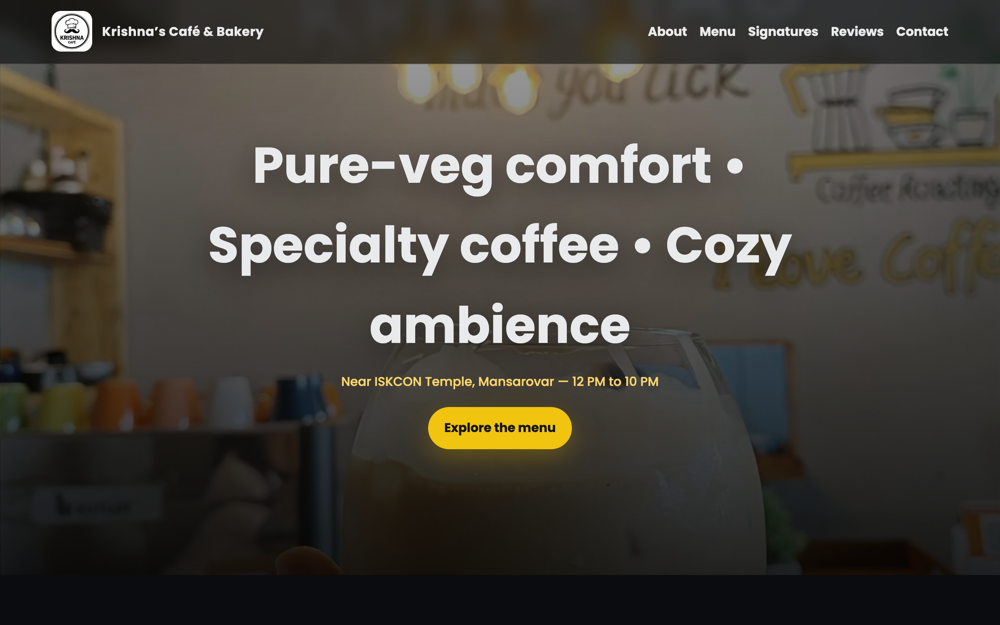

# ☕ Krishna Cafe

> Experience the warmth and aroma of the finest blends at Krishna Cafe. A digital gateway to your favorite cozy spot.

## ✨ Features

- **Immersive UI**: A warm, inviting design that mirrors the cafe's ambiance.
- **Responsive Layout**: Perfectly optimized for mobile, tablet, and desktop.
- **Dynamic Menu**: Interactive menu display with mouth-watering visuals.
- **Smooth Animations**: Subtle transitions for a premium user experience.

## 🛠️ Tech Stack

- **HTML5**: Semantic structure.
- **CSS3**: Custom styling with modern layout techniques.
- **JavaScript**: Interactive elements and dynamic content.

## 🚀 Getting Started

1. Clone the repository.
2. Open `index.html` in your browser.
3. Enjoy the brew! ☕
