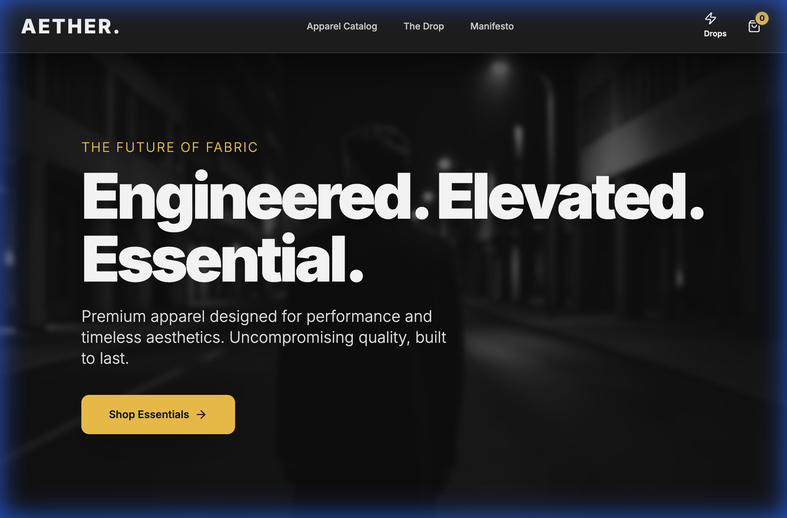
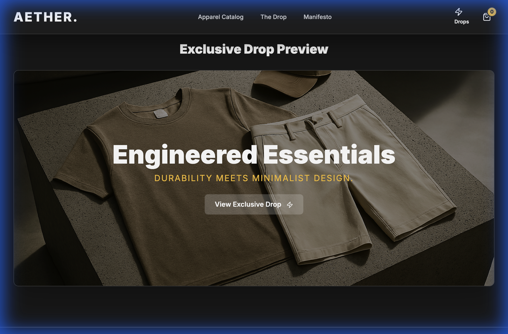

# 🛍️ Krishna E-com 1

> Your one-stop shop. Discover a world of quality products delivered right to your doorstep.

## ✨ Features

- **User-Friendly Interface**: Intuitive navigation for a seamless shopping spree.
- **Secure Payments**: Integrated payment gateways for safe transactions.
- **Order Tracking**: Real-time updates on your package's journey.
- **Wishlist**: Save your favorites for later.

## 📸 Gallery

  
  

## 🛠️ Tech Stack

- **HTML5**: The skeleton.
- **CSS3**: The skin.
- **JavaScript**: The brain.

## 🚀 Getting Started

1. Clone the repository.
2. Open `index.html` to fill your cart.
