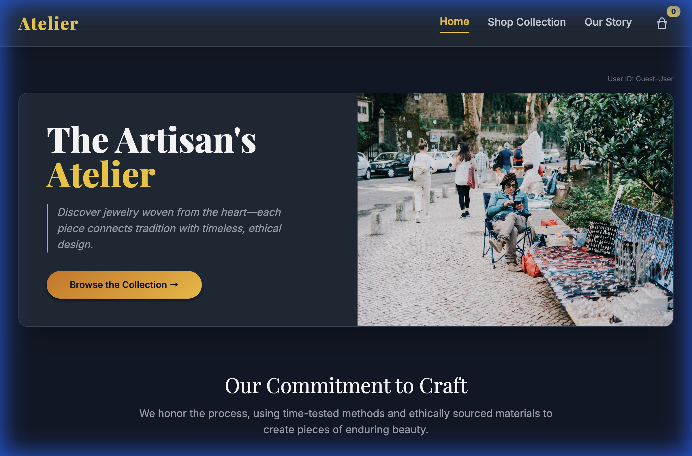
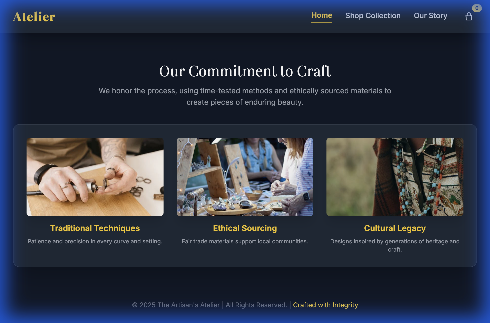

# 🎨 The Artisan's Atelier

> curated collection of handcrafted excellence. Where tradition meets modern elegance in a seamless e-commerce experience.

## ✨ Features

- **Elegant Design**: Minimalist aesthetic focusing on product beauty.
- **Product Showcase**: High-quality image galleries with zoom capabilities.
- **Cart Functionality**: Smooth shopping cart integration.
- **Mobile First**: optimized shopping experience on any device.

## 📸 Gallery

  
  

## 🛠️ Tech Stack

- **HTML5**: Structure and semantics.
- **CSS3**: Advanced styling and responsive grids.
- **JavaScript**: Cart logic and UI interactions.

## 🚀 Getting Started

1. Clone the repository.
2. Open `index.html` to browse the collection.
