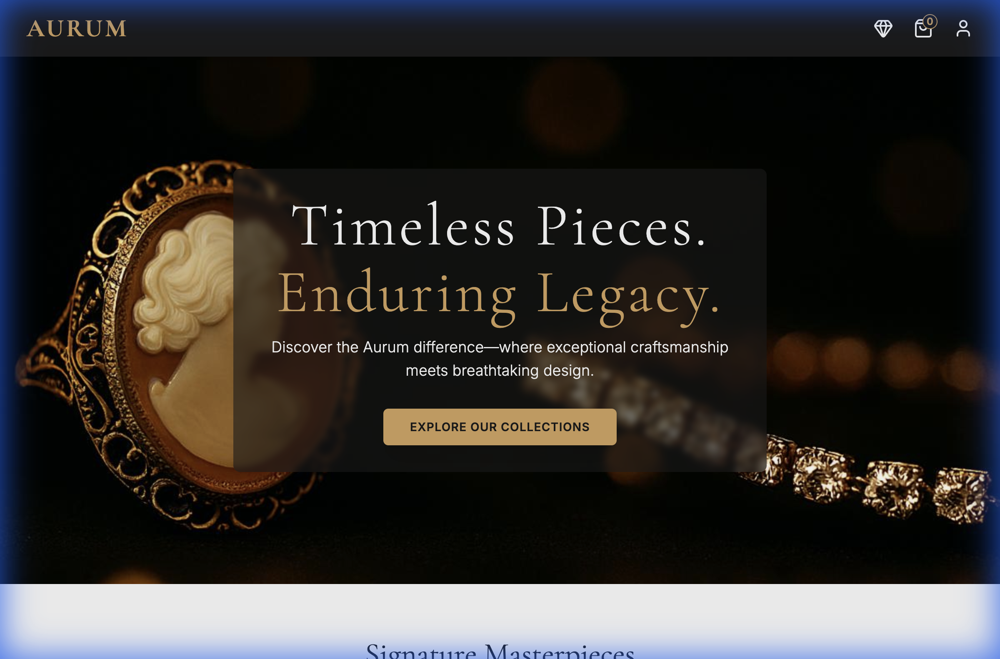
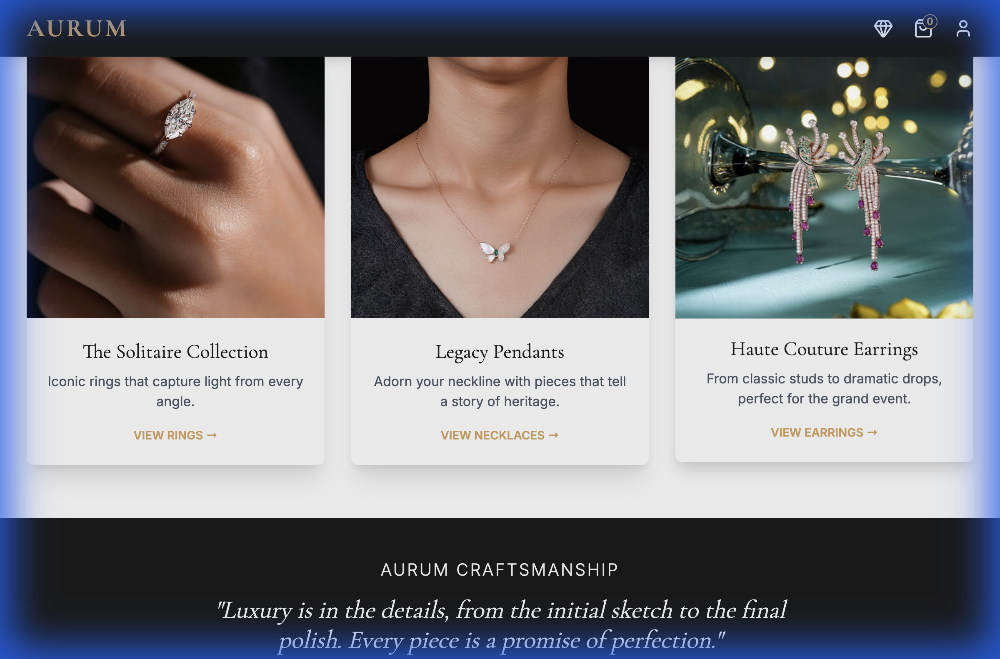

# 💎 Krishna Jewellery

> Adorn yourself with elegance. Discover a collection where timeless craftsmanship meets modern luxury.

## ✨ Features

- **Luxury Showcase**: High-resolution imagery highlighting intricate details.
- **Collection Filtering**: Browse by category, material, or occasion.
- **Virtual Try-On**: (Concept) Interactive elements for visualizing pieces.
- **Secure Inquiries**: Direct line to concierge for pricing and availability.

## 📸 Gallery

  
  

## 🛠️ Tech Stack

- **HTML5**: Semantic structure.
- **CSS3**: Gold-standard styling and animations.
- **JavaScript**: Interactive gallery and filtering logic.

## 🚀 Getting Started

1. Clone the repository.
2. Open `index.html` to explore the gems.
