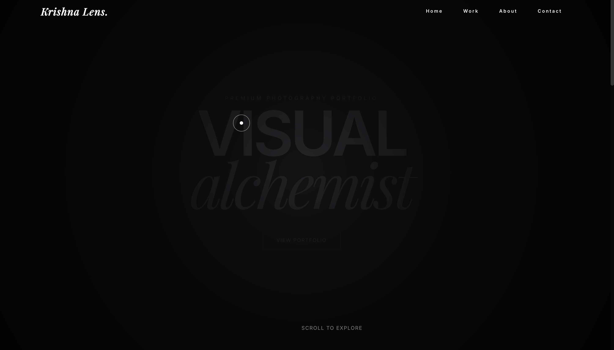

# 📸 Krishna Lens

> Visual storytelling at its finest. A minimalist portfolio for capturing life's moments.

## ✨ Features

- **Masonry Gallery**: Dynamic layout for displaying diverse aspect ratios.
- **Lightbox View**: Immersive full-screen image viewing.
- **Client Proofing**: Private galleries for client selection.
- **Print Store**: Integrated e-commerce for selling prints.

## 📸 Gallery

  
  
  
  

## 🛠️ Tech Stack

- **HTML5**: Markup.
- **Tailwind CSS**: Styling.
- **JavaScript**: Gallery interactions.

## 🚀 Getting Started

1. Clone the repository.
2. Open `index.html` to view the portfolio.
